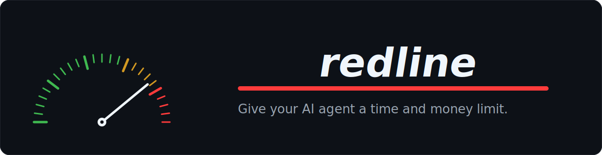

<p align="center">
  
</p>

<p align="center">
  <b>Hard time + token/$ budgets for Claude Code.</b><br>
  Your agent paces itself to land <i>within</i> the line — never over, never an abrupt kill.
</p>

<p align="center">
  <a href="https://github.com/sankalpgunturi/redline/actions/workflows/ci.yml"></a>
  
  
  
</p>

<p align="center">
  <a href="https://sankalpgunturi.github.io/redline">Website</a> ·
  <a href="docs/ARCHITECTURE.md">Architecture</a> ·
  <a href="docs/CONTRIBUTING.md">Contributing</a> ·
  <a href="docs/SECURITY.md">Security</a> ·
  <a href="docs/ARCHITECTURE.md#honest-limits">Limits</a> ·
  <a href="assets/showcase.html">Demo</a>
</p>

---

## What it does

Set a budget any time, inside Claude Code:

```
/redline 10m $5
```

You get a live burn-down in your statusline, and an agent that converges to finish inside it:

```
redline  ⏱ ███████████░ 90%  ·  ⏱ 1:00 left  ·  💰 $1.85 left
```

**The promise** — [why it holds →](docs/ARCHITECTURE.md#the-reserve-landing-model-never-over-never-abrupt)

- 🔴 **Never over** — the budget is an inviolable ceiling.
- 🏁 **Under is success** — lands ~90% with the task done.
- 🪂 **Never abrupt** — always finishes with a usable result; no mid-sentence kill.

> One budget covers everything the session spawns — **fanned subagents share the same umbrella**, counted *and* enforced. You never budget a subagent separately. [How →](docs/ARCHITECTURE.md#session-wide-subagent-umbrella)

## Install

Needs the Node that ships with Claude Code. Pick one, then restart Claude Code:

**Homebrew**
```bash
brew install sankalpgunturi/redline/redline && redline install
```

**curl**
```bash
curl -fsSL https://raw.githubusercontent.com/sankalpgunturi/redline/main/install.sh | bash
```

**git**
```bash
git clone https://github.com/sankalpgunturi/redline && cd redline && ./install.sh
```

Backs up your settings, never clobbers an existing statusline, safe to re-run. Remove anytime with `redline uninstall`.

## Use

| Command | Budget |
|---|---|
| `/redline 10m` | 10 minutes |
| `/redline $5` | $5 |
| `/redline 30m $5` | 30 min **+** $5 |
| `/redline 1h 200k` | 1 hour **+** 200k tokens |
| `/redline 45m 10%` | 45 min **+** 10% of your plan |
| `/redline off` | clear |

Whichever dimension is closest to its limit drives the bar (tagged with its gauge). Each shows a single countdown — `⏱ 1:00 left`, `💰 $1.85 left`.

## Commands

| Command | What |
|---|---|
| `redline stats` | did your sessions land within budget? (local, no network) |
| `redline watch` | smooth ~10×/sec budget ticker for a split pane |
| `redline uninstall` | remove redline from Claude Code |
| `redline version` | |

## Analytics

One metric: **did the session land within budget?** Every run logs its outcome locally (no network):

```bash
redline stats
```
```
  redline · did it land within budget?
  ██████████████░░░░░░░░░░  60% landed  (3/5 sessions)
  landed ≤100%: 3     over budget: 2 · avg overshoot 21%
```

---

<p align="center"><sub>MIT © redline contributors · built on Claude Code's native hooks + statusline · zero dependencies</sub></p>
